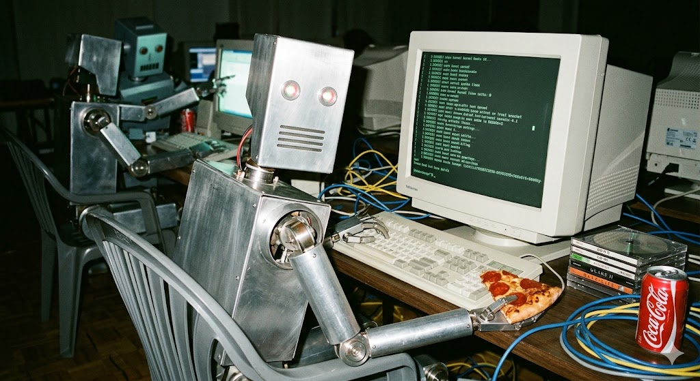

# claude-cowork-rs



Linux daemon for **Claude Desktop Cowork** (Local Agent Mode). Lets Claude Desktop delegate coding tasks to a local Claude Code instance on Linux — no VM required.

## How it works

Claude Desktop's Cowork feature communicates with a local VM service over a Unix socket using length-prefixed JSON-RPC. On macOS it uses Apple's Virtualization Framework, on Windows Hyper-V. On Linux there's no official VM backend.

This daemon implements the same protocol, but runs commands **directly on the host** instead of inside a VM. Single static binary, zero dependencies.

```
Claude Desktop (Electron)
    | (Length-prefixed JSON-RPC over Unix socket)
    v
claude-cowork-rs daemon
    |
    +-- Process spawning (tokio)
    +-- Path remapping (VM paths -> real paths)
    +-- Event streaming (stdout/stderr/exit)
    +-- Session management
```

## Requirements

- Linux (x86_64 or aarch64)
- [Claude Desktop](https://claude.ai/download) for Linux
- Claude Pro subscription (or higher) for Cowork access
- [Claude Code CLI](https://docs.anthropic.com/en/docs/claude-code) installed

## Install

### One-liner

```bash
curl -fsSL https://raw.githubusercontent.com/bKNNNNN/claude-cowork-rs/main/scripts/install.sh | bash
```

### Arch Linux (AUR)

```bash
yay -S claude-cowork-rs
```

### From source

```bash
git clone https://github.com/bKNNNNN/claude-cowork-rs.git
cd claude-cowork-rs
cargo build --release
cp target/release/claude-cowork-rs ~/.local/bin/
```

### Systemd service

```bash
# Copy the service file
mkdir -p ~/.config/systemd/user
cp packaging/claude-cowork.service ~/.config/systemd/user/

# Enable and start
systemctl --user daemon-reload
systemctl --user enable --now claude-cowork
```

## Usage

```bash
# Run in foreground (debug mode)
claude-cowork-rs --debug

# Health check
claude-cowork-rs --health

# Show status
claude-cowork-rs --status

# Custom socket path
claude-cowork-rs --socket-path /tmp/my-socket.sock

# Clean up stale sessions
claude-cowork-rs --cleanup
```

## Uninstall

```bash
curl -fsSL https://raw.githubusercontent.com/bKNNNNN/claude-cowork-rs/main/scripts/install.sh | bash -s -- --uninstall
```

Or manually:

```bash
systemctl --user disable --now claude-cowork
rm ~/.local/bin/claude-cowork-rs
rm ~/.config/systemd/user/claude-cowork.service
rm -rf ~/.local/share/claude-cowork
```

## Protocol

The daemon implements 17 RPC methods over a Unix socket at `$XDG_RUNTIME_DIR/cowork-vm-service.sock`.

### Transport

Every message is framed with a **4-byte big-endian length prefix** followed by the JSON body (max 10 MB):

```
+--------+---------------------------+
| 4 bytes|       N bytes             |
| (BE u32)|      JSON body           |
+--------+---------------------------+
```

Claude Desktop opens **two connections**: one for RPC (request-reply) and one for event streaming (`subscribeEvents`).

### Request / Response

```json
// Request
{ "method": "isRunning", "params": {}, "id": 1 }

// Success response
{ "success": true, "result": { "running": true } }

// Error response
{ "success": false, "error": "process not found" }
```

### Events

Events are pushed to `subscribeEvents` clients as length-prefixed JSON:

```json
{ "type": "stdout", "id": "proc-123", "data": "Hello world\n" }
{ "type": "exit", "id": "proc-123", "exitCode": 0 }
{ "type": "vmStarted", "name": "session-abc" }
{ "type": "vmStopped", "name": "session-abc" }
{ "type": "apiReachability", "reachability": "reachable", "willTryRecover": false }
{ "type": "error", "id": "proc-123", "message": "spawn failed", "fatal": true }
```

### RPC Methods

| Method | Description | Key params |
|--------|-------------|------------|
| `configure` | Accept VM config (no-op) | `memoryMb`, `cpuCount` |
| `createVM` | Create session directory | `name`, `bundlePath` |
| `startVM` | Emit vmStarted + apiReachability events | `name`, `bundlePath` |
| `stopVM` | Kill all processes, cleanup | `name` |
| `isRunning` | Return running state | — |
| `isGuestConnected` | Return connected state | — |
| `spawn` | Run command with path remapping | `name`, `id`, `command`, `args`, `env`, `cwd`, `additionalMounts` |
| `kill` | Signal process group | `id`, `signal` (SIGTERM, SIGKILL, SIGINT, SIGQUIT, SIGHUP) |
| `writeStdin` | Write to stdin with path remapping | `id`, `data` |
| `isProcessRunning` | Check process status | `id` |
| `mountPath` | No-op (native paths) | `hostPath`, `guestPath` |
| `readFile` | Read file contents | `name`, `path` |
| `installSdk` | No-op | — |
| `addApprovedOauthToken` | No-op | `name`, `token` |
| `setDebugLogging` | Toggle verbose logging | `enabled` |
| `subscribeEvents` | Stream events (blocks connection) | — |
| `getDownloadStatus` | Return "ready" | — |

### spawn details

The `spawn` method does several transformations before executing a command:

1. Creates symlinks in `~/.local/share/claude-cowork/sessions/<name>/mnt/` for each mount
2. Builds path remaps: `/sessions/<name>/mnt/<mount>` → real host path
3. Inherits daemon env, overlays requested vars, filters blocked keys (`CLAUDECODE`, `CLAUDE_CODE_ENTRYPOINT`)
4. Remaps VM paths in args, replaces `--mcp-config` value with `{"mcpServers":{}}` (strips SDK servers)
5. Resolves cwd to real workspace mount path (Glob doesn't follow symlinks)
6. Spawns process with `setpgid` for group signal management

### Session flow

```
Client                          Daemon
  |--- configure --------------→ |  (no-op)
  |--- createVM ---------------→ |  (create session dir)
  |--- startVM ----------------→ |  (set running)
  |--- subscribeEvents --------→ |  (on 2nd connection)
  |←-- vmStarted + apiReachable  |  (after 500ms)
  |--- spawn ------------------→ |  (spawn claude process)
  |←-- stdout events ----------- |  (streaming)
  |--- writeStdin -------------→ |  (send input)
  |--- isProcessRunning -------→ |  (poll status)
  |←-- exit event -------------- |  (process exits)
  |--- stopVM -----------------→ |  (cleanup)
```

## Troubleshooting

### Daemon not starting

```bash
# Check if socket exists
ls -la ${XDG_RUNTIME_DIR}/cowork-vm-service.sock

# Check systemd logs
journalctl --user -u claude-cowork -f

# Run in debug mode
claude-cowork-rs --debug
```

### Claude Desktop doesn't see Cowork

Make sure the daemon is running and the socket is at the expected path. Restart Claude Desktop after starting the daemon.

### Process spawn fails

Check that `claude` CLI is in your PATH:
```bash
which claude
```

## Credits

Inspired by:
- [patrickjaja/claude-cowork-service](https://github.com/patrickjaja/claude-cowork-service) — Go daemon implementation
- [johnzfitch/claude-cowork-linux](https://github.com/johnzfitch/claude-cowork-linux) — JS Electron patch approach

## License

MIT
